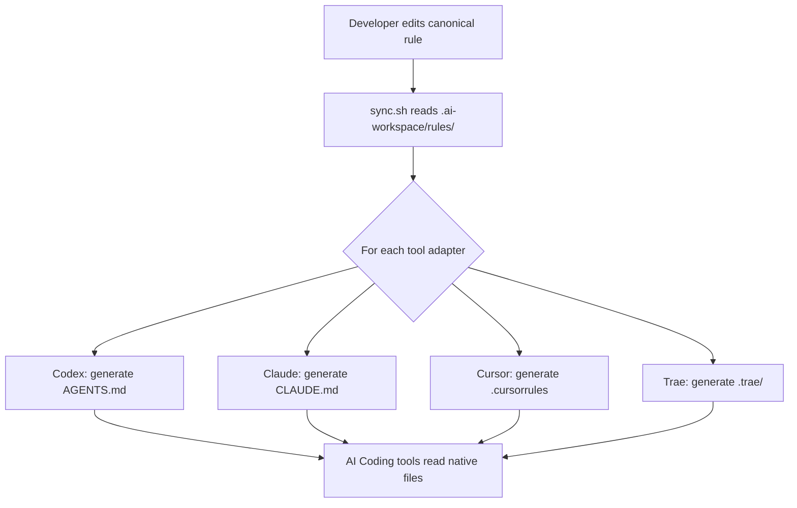

English | [简体中文](ARCHITECTURE.zh-CN.md)

# Architecture

## Overview

AI Workspace follows a **three-layer architecture** designed to decouple
project knowledge from tool-specific formats.

```
┌──────────────────────────────────────────┐
│           ROOT (Tool-Facing)              │
│  AGENTS.md  CLAUDE.md  .cursorrules ...  │
│         ↑ generated thin stubs           │
├──────────────────────────────────────────┤
│           ADAPTER LAYER                   │
│  .ai-workspace/adapters/{tool}/           │
│         ↑ format translation             │
├──────────────────────────────────────────┤
│           CANONICAL LAYER                 │
│  .ai-workspace/rules/                     │
│  .ai-workspace/skills/                    │
│  .ai-workspace/memory/                    │
│         ↑ single source of truth         │
└──────────────────────────────────────────┘
```

## Layer Responsibilities

### Canonical Layer

The invariant core. Contains all project rules, conventions, skills, and
memory in a tool-agnostic format. This layer has no knowledge of any
specific AI Coding tool.

**Key principle**: A new developer reading only this layer should understand
all project conventions without knowing which AI tool will be used.

### Adapter Layer

Thin translation modules. Each adapter (under 50 lines) maps canonical
rules into a specific tool's expected format. Adapters handle:

- Include/import syntax differences
- Formatting preferences (YAML frontmatter vs. XML comments vs. plain text)
- Selective rule inclusion based on project context

### Root Layer

Tool-native entry points. These are the files AI Coding tools actually
read (`AGENTS.md`, `CLAUDE.md`, `.cursorrules`). They are generated by
the sync script and should never be edited manually for content changes.

## Data Flow



## Key Abstractions

| Abstraction | Representation | Location |
|---|---|---|
| **Rule** | Markdown file with YAML frontmatter | `.ai-workspace/rules/` |
| **RuleSet** | Directory of related rules | `.ai-workspace/rules/domains/` |
| **Adapter** | Template + mapping | `.ai-workspace/adapters/<tool>/` |
| **Skill** | SKILL.md + resources | `.ai-workspace/skills/<name>/` |
| **Memory** | ADR + context + decision log | `.ai-workspace/memory/` |
| **MCP Config** | YAML server/tool definitions | `.ai-workspace/mcp/` |

## File Format Contract

### Canonical Rule

```markdown
---
id: "nn-topic"
title: "Human-Readable Title"
priority: 1
scope: "always"
---

# Title

## Section

- Rule statement in imperative mood.
```

### Adapter Mapping

```yaml
tool: codex
version: ">=1.0"
includes_support: true
include_syntax: "@{path}"
rules:
  - source: rules/00-core.md
    required: true
```

## Directory Rationale

### Why `.ai-workspace/` and not other names?

The dot-prefix keeps it hidden on Unix systems while remaining visible
in editors. The name `.ai-workspace` is descriptive but not tied to any
specific tool. Alternatives considered:

- `.ai/` — too short, namespace collision risk
- `.ai-infra/` — too technical
- `ai-workspace/` — visible to casual `ls`, creates noise

### Why `rules/` and `adapters/` are separate?

Rules are stable project knowledge. Adapters are mechanical translations.
Mixing them creates churn: a tool format change should not touch rule files,
and a rule change should not require understanding tool-specific formats.

### Why `memory/` is not a subdirectory of `rules/`?

Rules are prescriptive ("do this"). Memory is descriptive ("we decided
this"). They have different update frequencies, different authors, and
different review requirements.
