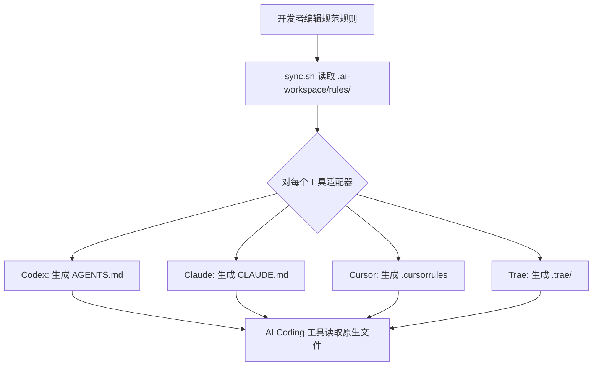

# 架构设计

[English](ARCHITECTURE.md) | 简体中文

## 概述

AI Workspace 采用**三层架构**，将项目知识与工具特定格式解耦。

```
┌──────────────────────────────────────────┐
│           根层（工具面向层）               │
│  AGENTS.md  CLAUDE.md  .cursorrules ...  │
│         ↑ 生成的薄桩文件                  │
├──────────────────────────────────────────┤
│           适配器层                         │
│  .ai-workspace/adapters/{tool}/           │
│         ↑ 格式翻译                        │
├──────────────────────────────────────────┤
│           规范层                           │
│  .ai-workspace/rules/                     │
│  .ai-workspace/skills/                    │
│  .ai-workspace/memory/                    │
│         ↑ 单一事实来源                    │
└──────────────────────────────────────────┘
```

## 各层职责

### 规范层

不变的核心。包含所有项目规则、约定、技能和记忆，格式与任何特定工具无关。此层对 AI Coding 工具的存在一无所知。

**核心原则**：仅阅读此层的新开发者应能理解所有项目约定，无需知道将使用哪种 AI 工具。

### 适配器层

薄翻译模块。每个适配器（不超过 50 行）将规范规则映射到特定工具的期望格式。适配器处理：

- Include/import 语法差异
- 格式偏好（YAML frontmatter vs. XML 注释 vs. 纯文本）
- 基于项目上下文的选择性规则包含

### 根层

工具原生入口点。这些是 AI Coding 工具实际读取的文件（`AGENTS.md`、`CLAUDE.md`、`.cursorrules`）。它们由 sync 脚本生成，**绝不**应手动编辑以更改内容。

## 数据流



## 核心抽象

| 抽象 | 表示形式 | 位置 |
|---|---|---|
| **规则** | 带 YAML frontmatter 的 Markdown 文件 | `.ai-workspace/rules/` |
| **规则集** | 相关规则的目录 | `.ai-workspace/rules/domains/` |
| **适配器** | 模板 + 映射 | `.ai-workspace/adapters/<tool>/` |
| **技能** | SKILL.md + 资源 | `.ai-workspace/skills/<name>/` |
| **记忆** | ADR + 上下文 + 决策日志 | `.ai-workspace/memory/` |
| **MCP 配置** | YAML 服务器/工具定义 | `.ai-workspace/mcp/` |

## 文件格式契约

### 规范规则

```markdown
---
id: "nn-topic"
title: "人类可读的标题"
priority: 1
scope: "always"
---

# 标题

## 章节

- 以祈使语气表述的规则。
```

### 适配器映射

```yaml
tool: codex
version: ">=1.0"
includes_support: true
include_syntax: "@{path}"
rules:
  - source: rules/00-core.md
    required: true
```

## 目录命名理由

### 为什么是 `.ai-workspace/`？

点前缀在 Unix 系统上隐藏目录，但在编辑器中仍然可见。名称描述性强但不绑定任何特定工具。已考虑但放弃的替代：

- `.ai/` — 太短，存在命名空间冲突风险
- `.ai-infra/` — 过于技术化
- `ai-workspace/` — 对 `ls` 可见，产生噪音

### 为什么 `rules/` 和 `adapters/` 分离？

规则是稳定的项目知识。适配器是机械翻译。混合它们会产生不必要的变更：工具格式变更不应触及规则文件，规则变更也不应要求理解工具特定格式。

### 为什么 `memory/` 不是 `rules/` 的子目录？

规则是规定性的（"这样做"）。记忆是描述性的（"我们决定了这个"）。它们有不同的更新频率、不同的作者和不同的审查要求。
