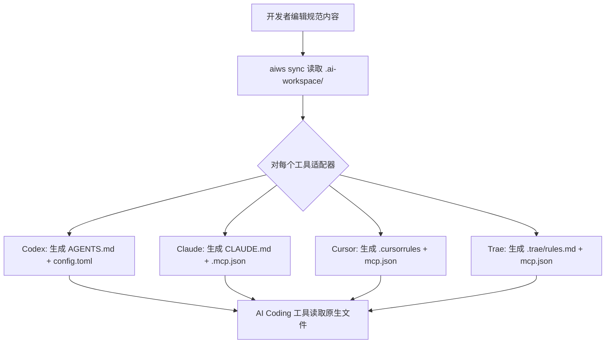
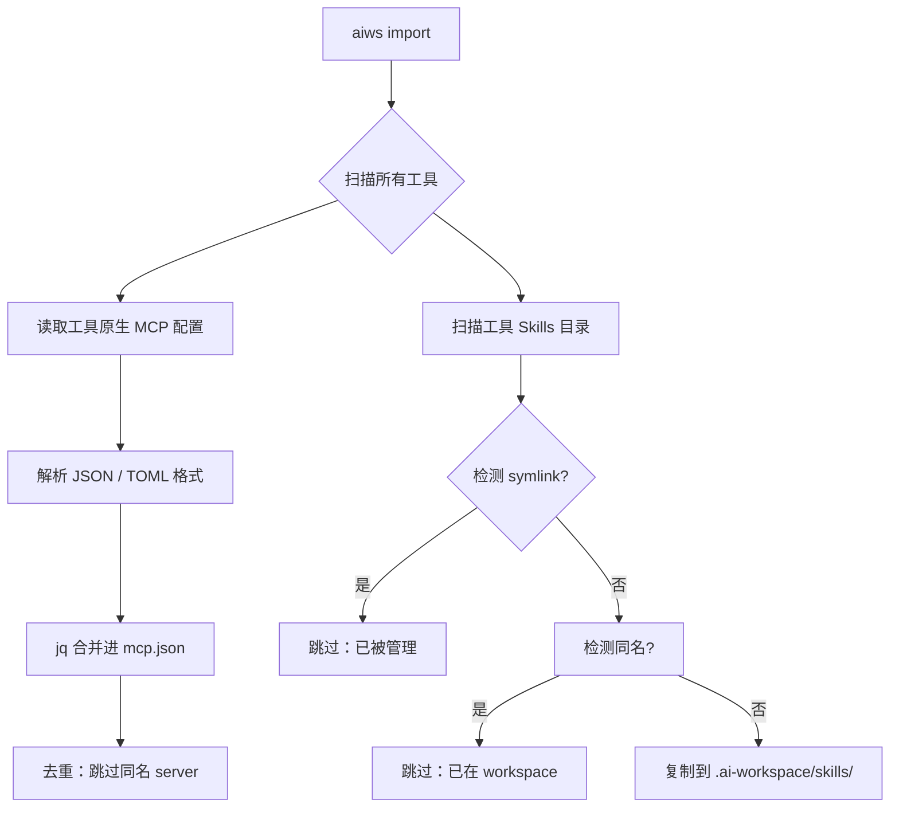

# 架构设计

## 概述

AI Workspace 采用**三层架构**，将项目知识与工具特定格式解耦。

```
┌──────────────────────────────────────────┐
│           根层（工具面向层）               │
│  AGENTS.md  CLAUDE.md  .cursorrules ...  │
│         ↑ 生成的薄桩文件                  │
├──────────────────────────────────────────┤
│           适配器层                         │
│  .ai-workspace/adapters/{tool}/           │
│         ↑ 格式翻译                        │
├──────────────────────────────────────────┤
│           规范层                           │
│  .ai-workspace/rules/                     │
│  .ai-workspace/skills/                    │
│  .ai-workspace/mcp/                       │
│  .ai-workspace/memory/                    │
│  .ai-workspace/secrets/                   │
│  .ai-workspace/config/                    │
│         ↑ 单一事实来源                    │
└──────────────────────────────────────────┘
```

## 各层职责

### 规范层

不变的核心。包含所有项目规则、约定、技能、MCP 配置、密钥和记忆，格式与任何特定工具无关。此层对 AI Coding 工具的存在一无所知。

**核心原则**：仅阅读此层的新开发者应能理解所有项目约定，无需知道将使用哪种 AI 工具。

### 适配器层

薄翻译模块。每个适配器（不超过 50 行）将规范规则映射到特定工具的期望格式。适配器处理：

- Include/import 语法差异
- 格式偏好（YAML frontmatter vs. HTML 注释 vs. 纯文本）
- MCP 配置格式转换（JSON ↔ TOML）
- 基于 `mapping.yaml` 的规则选择性包含

### 根层

工具原生入口点。这些是 AI Coding 工具实际读取的文件（`AGENTS.md`、`CLAUDE.md`、`.cursorrules`、`.trae/rules.md`）。它们由 sync 脚本生成，**绝不**应手动编辑以更改内容。

此外还包括工具原生 MCP 配置（`.mcp.json`、`.codex/config.toml` 等）和 Skills 目录。

## 数据流

### 正向同步（sync）



### 反向导入（import）



### 全量同步（sync）

`aiws sync` 同时执行三个阶段：

| 阶段 | 内容 | 源 → 目标 |
|---|---|---|
| **规则同步** | 7 核心 + 6 领域规则 | `.ai-workspace/rules/*.md` → `CLAUDE.md` 等 |
| **MCP 同步** | MCP 服务器配置 | `.ai-workspace/mcp/mcp.json + mcp.local.json` → 各工具原生配置 |
| **Skills 同步** | 跨工具技能定义 | `.ai-workspace/skills/*/` → symlink 到各工具 skills 目录 |

## 核心抽象

| 抽象 | 表示形式 | 位置 |
|---|---|---|
| **规则** | 带 YAML frontmatter 的 Markdown 文件 | `.ai-workspace/rules/` |
| **规则集** | 相关规则的目录 | `.ai-workspace/rules/domains/` |
| **适配器** | mapping.yaml + 模板 | `.ai-workspace/adapters/<tool>/` |
| **技能** | SKILL.md + 资源 | `.ai-workspace/skills/<name>/` |
| **记忆** | ADR + 上下文 + 决策日志 | `.ai-workspace/memory/` |
| **MCP 配置** | JSON（`mcp.json`）+ 本地覆盖（`mcp.local.json`） | `.ai-workspace/mcp/` |
| **密钥** | age 加密的 JSON + TOTP 2FA | `.ai-workspace/secrets/` |
| **工作区配置** | JSON | `.ai-workspace/config/workspace.json` |

## 文件格式契约

### 规范规则

```markdown
---
id: "nn-topic"
title: "人类可读的标题"
scope: all
description: "可选的描述信息"
globs:
  - "**/*.cs"
---

# 标题

## 章节

- 以祈使语气表述的规则。
```

### 适配器映射

```yaml
tool: codex
version: ">=0.1"
includes_support: true          # 工具是否支持 @include 语法？
include_syntax: "@{path}"       # Include 语法模式
rules:
  - source: rules/00-core.md
    required: true              # true = 始终包含，false = 领域规则（可选加载）
  - source: rules/domains/aspnet.md
    required: false
```

### MCP 配置

```json
{
  "servers": {
    "filesystem": {
      "command": "npx",
      "args": ["-y", "@modelcontextprotocol/server-filesystem", "/path"],
      "scope": ["global", "project"]
    },
    "browser-use": {
      "command": "npx",
      "args": ["-y", "@anthropic/mcp-server-browseruse"],
      "scope": ["project"]
    }
  }
}
```

`scope` 字段控制 server 分发到哪些工具 scope（`global` = 全局安装，`project` = 项目级安装）。

### SKILL.md

```markdown
---
name: brainstorm
description: 结构化构思和设计探索
disable-model-invocation: true
---

# Brainstorm

技能的使用说明和规则...
```

## 脚本架构

```
.ai-workspace/scripts/
├── aiws                    # CLI 入口（唯一用户接口）
├── validate.sh             # 校验脚本
└── lib/                    # 脚本库
    ├── common.sh           #   共享工具（日志、路径、配置、文件操作）
    ├── mcp-sync.sh         #   MCP 同步引擎（合并、scope 过滤、密钥替换、格式生成）
    ├── skills-link.sh      #   Skills 链接引擎（发现、symlink、安装）
    ├── import-mcp.sh       #   MCP 反向导入引擎（JSON/TOML 解析、去重、合并）
    ├── import-skills.sh    #   Skills 反向导入引擎（扫描、symlink 检测、去重、复制）
    ├── platform.sh         #   跨平台链接抽象（symlink、junction、复制回退）
    └── vault.sh            #   加密密钥管理（age + TOTP 2FA + 权限控制）
```

## CLI 命令体系

```
aiws
├── setup              # 初始化工作区目录结构 + 可选 vault 初始化
├── sync               # 正向同步：规范层 → 工具原生文件（规则 + MCP + Skills）
├── validate           # 校验工作区结构和配置
├── import             # 反向导入：工具原生文件 → 规范层
│   ├── mcp            #   从工具导入 MCP 配置
│   ├── skills         #   从工具导入 Skills
│   └── rules          #   从工具导入 Rules（预留）
├── mcp                # MCP 管理
│   ├── list           #   列出所有 MCP 服务器
│   ├── add            #   添加新 MCP 服务器
│   ├── remove         #   移除 MCP 服务器
│   └── show           #   查看服务器详情
├── skills             # Skills 管理
│   ├── list           #   列出所有技能及同步状态
│   ├── link           #   链接技能到工具
│   ├── unlink         #   解除链接
│   └── install        #   从 Git/npm/本地路径安装技能
└── secrets            # 密钥管理
    ├── set            #   设置加密密钥
    ├── list           #   列出密钥名称
    ├── remove         #   移除密钥
    └── audit          #   查看密钥使用情况
```

## 设计权衡

| 决策 | 原因 |
|---|---|
| MCP 配置存储为 JSON（非 YAML） | `jq` 生态成熟，解析可靠；mapping.yaml 用 YAML 是因为需要人类编辑注释 |
| 规则全量拼接（当前） | 简单可靠；`mapping.yaml` 的 `required` 字段预留给未来按需选择 |
| Skills 用 symlink（非复制） | 修改源文件所有工具立即可见，节省磁盘空间 |
| Codex MCP 输出 TOML（非 JSON） | Codex 原生格式就是 TOML，需要 awk 解析而不引入额外依赖 |
| Shell 脚本（非 Node/Python） | 零依赖；POSIX shell 在所有平台可用 |

## 目录命名理由

### 为什么是 `.ai-workspace/`？

点前缀在 Unix 系统上隐藏目录，但在编辑器中仍然可见。名称描述性强但不绑定任何特定工具。已考虑但放弃的替代：

- `.ai/` — 太短，存在命名空间冲突风险
- `.ai-infra/` — 过于技术化
- `ai-workspace/` — 对 `ls` 可见，产生噪音

### 为什么 `rules/` 和 `adapters/` 分离？

规则是稳定的项目知识。适配器是机械翻译。混合它们会产生不必要的变更：工具格式变更不应触及规则文件，规则变更也不应要求理解工具特定格式。

### 为什么 `memory/` 不是 `rules/` 的子目录？

规则是规定性的（"这样做"）。记忆是描述性的（"我们决定了这个"）。它们有不同的更新频率、不同的作者和不同的审查要求。
