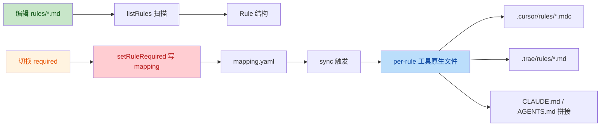

# Code Review — 规则业务域

**日期**：2026-08-24
**范围**：规则（Rules）业务域全链路
**审查者**：TRAE-code-review（2 子代理交叉验证）
**关联**：[FEATURE_BREAKDOWN.md §1](./../FEATURE_BREAKDOWN.md) · [ARCHITECTURE.md](./reference/ARCHITECTURE.md) · [DESIGN_PHILOSOPHY.md](./reference/DESIGN_PHILOSOPHY.md)

---

## 0. 审查范围

按 FEATURE_BREAKDOWN.md 划定的"规则"业务域，覆盖以下源文件：

| 层 | 文件 | 行数 | 状态 |
|---|---|---|---|
| Desktop core | `electron/src/core/rules.ts` | 98 | ✅ |
| Desktop core | `electron/src/core/sync.ts`（`generateRuleFiles` 段） | 70 | ✅（节选） |
| Desktop IPC | `electron/src/main/ipc.ts`（RulesSetRequired handler） | 14 | ✅ |
| Desktop renderer | `electron/src/renderer/pages/rules.tsx` | 52 | ✅ |
| TUI 屏 | `tui/src/screens/rules.jsx` | 45 | ✅ |
| TUI lib | `tui/src/lib/rules.js` | 47 | ✅ |
| TUI lib | `tui/src/lib/aiws.js` | 33 | ✅（节选） |
| CLI | `.ai-workspace/scripts/lib/rules-generate.sh` | 186 | ✅ |
| CLI | `.ai-workspace/scripts/lib/common.sh` | 325 | ✅（节选） |
| 适配器 | `adapters/{codex,claude,cursor,trae}/mapping.yaml` | 4 份 | ✅ |
| 测试 | `electron/test/rules.test.ts` | 51 | ✅ |

**未审查**（按 skill 规则跳过）：
- 规则正文（`.ai-workspace/rules/*.md`、`domains/*.md`）— 散文/配置
- 适配器头注释模板（`claude.md` / `codex.md` / `cursor.md` / `trae.md`）— 纯注释
- 根层生成产物（`CLAUDE.md` / `AGENTS.md` / `.cursorrules` / `.trae/rules.md`）— 自动生成

---

## 1. 作者意图推断

规则业务域的端到端目标：

1. **解析规范层** — 扫描 `rules/*.md` + `rules/domains/*.md`，从 YAML frontmatter 提取 `id/scope/globs`
2. **查询装载意图** — 读 `adapters/<tool>/mapping.yaml` 中每条规则的 `required`（true=始终装载，false=按 glob 装载）
3. **切换装载状态** — 改写 `mapping.yaml` 的 `required: true/false`
4. **生成工具原生文件** — 为 Cursor / Trae 输出 per-rule `.mdc` / `.md`；为 Codex / Claude 拼接为单文件 + `@{path}` 引用

四层关系：



技术流（per-tool 分发）：

```mermaid
flowchart TD
    M[mapping.yaml] --> P{per-tool required}
    P -->|cursor/trae| R1[generate_rule_files per-file .mdc/.md]
    P -->|claude/codex| R2[单文件拼接 + @{path} include]
    R1 --> S1[strip frontmatter + emit frontmatter + body]
    R1 --> X1[rm -f out_dir/* 清空旧文件]
    S1 --> OUT1[.cursor/rules/{id}.mdc]
    S1 --> OUT2[.trae/rules/{id}.md]
    style X1 fill:#ffcdd2,color:#b71c1c
    style M fill:#c8e6c9,color:#1a5e20
```

---

## 2. 验证方法

- **第一遍**：主代理静态阅读 12 个源文件 + 4 个 mapping
- **交叉验证**：第二遍派 2 个独立子代理并行重读全部源码，逐条确认 12 个候选 issue 是否真实存在、严重程度是否恰当
- **共识机制**：2/2 确认 = High Confidence；1/2 = Medium（按就高原则提级）；0/2 = 排除

最终 12/12 全部经双代理确认，无 false positive。

---

## 3. 审查结果（按严重度排序）

### Major（9 项，需优先修复）

| No. | 类别 | Issue | 建议 | 代码位置 |
|-----|------|-------|------|---------|
| 1 | 正确性 / 数据模型 | `listRules` 硬编码只读 `adapters/cursor/mapping.yaml`，`Rule.required` 是单值字段，但实际是 per-tool 状态。其它 adapter 的 required 不可见。 | 把 `Rule.required: boolean` 改为 `Rule.requiredByTool: Record<SupportedTool, boolean>`；`listRules` 枚举 `adapters/*/mapping.yaml`；`setRuleRequired` 保持单 tool 写入 | [electron/src/core/rules.ts:5-11](file:///Users/xuanyi/Documents/AI-management/electron/src/core/rules.ts#L5-L11), [L63](file:///Users/xuanyi/Documents/AI-management/electron/src/core/rules.ts#L63), [L77](file:///Users/xuanyi/Documents/AI-management/electron/src/core/rules.ts#L77) |
| 2 | 跨平台 / 性能 | TUI 正则用 `\n`（LF）匹配，Windows CRLF 仓库会全部解析为 `false`；同时 mapping 文件在循环里被读 N 次 | (a) 改用 `[\r\n]+` 兼容 CRLF，或先 `replace(/\r\n/g, '\n')` 归一；(b) 把 `fs.readFileSync(MAPPING('cursor'))` 提到循环外 | [tui/src/lib/rules.js:23-29](file:///Users/xuanyi/Documents/AI-management/tui/src/lib/rules.js#L23-L29) |
| 3 | 正确性 | `findIndex(l => l.includes(`source: ${rel}`))` 是子串匹配；查找 `rules/foo.md` 时会误命中 `source: rules/foo.mdx`，写错条目 | 用正则 `new RegExp(\`^\\s*- source:\\s*${escapeRegex(rel)}\\s*$\`)` 锚定行首 + 整词；或先按行分块定位条目再写 | [electron/src/core/rules.ts:91](file:///Users/xuanyi/Documents/AI-management/electron/src/core/rules.ts#L91)（同源 bug：[L48 mappingRequired](file:///Users/xuanyi/Documents/AI-management/electron/src/core/rules.ts#L48)） |
| 4 | 数据安全 | `rm -f "$out_dir"/*` 无差别删除整个输出目录（含用户手动加的 .mdc/.md），无备份无提示 | (a) 用白名单删除（只删当前 mapping 声明过的 `{id}.mdc`）；(b) 删前 `.bak` 备份；(c) 至少打印 `log_warn` 列被删文件清单。TS 端 `sync.ts:34-36` 同样需修 | [.ai-workspace/scripts/lib/rules-generate.sh:121-124](file:///Users/xuanyi/Documents/AI-management/.ai-workspace/scripts/lib/rules-generate.sh#L121-L124)；[electron/src/core/sync.ts:34-36](file:///Users/xuanyi/Documents/AI-management/electron/src/core/sync.ts#L34-L36) |
| 5 | 架构 / 一致性 | TUI 和 Desktop renderer 都把 `tool` 硬编码为 `'cursor'`；用户对其它工具的切换无法触发对应 sync | 引入 tool 选择器（顶部下拉 / Tab 切换）；`setRuleRequired` / `SyncRun` 调用前从选中态读取 tool | [tui/src/screens/rules.jsx:24](file:///Users/xuanyi/Documents/AI-management/tui/src/screens/rules.jsx#L24)；[electron/src/renderer/pages/rules.tsx:18](file:///Users/xuanyi/Documents/AI-management/electron/src/renderer/pages/rules.tsx#L18), [L24](file:///Users/xuanyi/Documents/AI-management/electron/src/renderer/pages/rules.tsx#L24) |
| 6 | 安全 / 校验 | IPC `RulesSetRequired` 不校验 `args.tool`，可直接拼路径（`../` 路径遍历、未知 tool 触发 fs 报错） | 在 `setRuleRequired` 入口对 `tool` 走 `assertSupportedTool(tool)`，复用 `core/errors.ts` 的 `WorkspaceError` + `ErrorCodes.UnsupportedTool` | [electron/src/main/ipc.ts:51-54](file:///Users/xuanyi/Documents/AI-management/electron/src/main/ipc.ts#L51-L54) |
| 8 | UX 谎言 | TUI `setRequired` 在 source / required 缺失时静默 `return false`，但 TUI 屏总是 `setMsg('切换成功')` 并触发 sync | 让 `setRequired` 抛错或返回 `{ok, error}`；屏内根据返回值决定提示文案；保留 sync 调用前的状态校验 | [tui/src/lib/rules.js:33-46](file:///Users/xuanyi/Documents/AI-management/tui/src/lib/rules.js#L33-L46)；[tui/src/screens/rules.jsx:22-26](file:///Users/xuanyi/Documents/AI-management/tui/src/screens/rules.jsx#L22-L26) |
| 9 | 正确性（潜在） | `/^scope:\|^globs:/m` 多行匹配未限定 frontmatter 边界；规则正文中若出现 `scope: 'all'` 示例（YAML / JS 代码块）会被误抓 | 先剥离 frontmatter（用现有 `stripFrontmatter` 或在文件最前面 `---` 之间切片），再对 frontmatter 段做 key 匹配 | [electron/src/core/rules.ts:14](file:///Users/xuanyi/Documents/AI-management/electron/src/core/rules.ts#L14), [L72](file:///Users/xuanyi/Documents/AI-management/electron/src/core/rules.ts#L72) |
| 12 | 可测试性 | TUI lib 在模块加载时立即调用 `getRoot()`（依赖 git），非 git 上下文（CI 临时目录、单元测试、纯 Node REPL）一 `require` 就崩 | 把 `RULES` / `MAPPING` 改成工厂函数 `rulesPaths(root)`，调用时再求值；`aiws.js:14` 的 `AIWS` 同源问题一并修 | [tui/src/lib/rules.js:6-7](file:///Users/xuanyi/Documents/AI-management/tui/src/lib/rules.js#L6-L7)；[tui/src/lib/aiws.js:14](file:///Users/xuanyi/Documents/AI-management/tui/src/lib/aiws.js#L14) |

### Minor（3 项，建议纳入下个迭代）

| No. | 类别 | Issue | 建议 | 代码位置 |
|-----|------|-------|------|---------|
| 7 | DRY | scope→globs 默认映射在 `rules.ts:27-31`（switch）和 `rules-generate.sh:84-88`（case）字面级复制 | 抽到 `electron/src/core/config.ts` 或一个独立的 `scope-globs.ts`（单测覆盖）；shell 侧从 `workspace.json` 或公共定义文件读取 | [electron/src/core/rules.ts:27-31](file:///Users/xuanyi/Documents/AI-management/electron/src/core/rules.ts#L27-L31)；[.ai-workspace/scripts/lib/rules-generate.sh:84-88](file:///Users/xuanyi/Documents/AI-management/.ai-workspace/scripts/lib/rules-generate.sh#L84-L88) |
| 10 | 一致性 | `rules.ts:92,95` 抛 plain `Error`；`ipc.ts:24-29` 只对 `WorkspaceError` 序列化 `code`，其他统一降级为 `InternalError` | 业务错误统一走 `throw new WorkspaceError(ErrorCodes.Xxx, 'message')`；让 IPC 序列化走业务码 | [electron/src/core/rules.ts:92](file:///Users/xuanyi/Documents/AI-management/electron/src/core/rules.ts#L92), [L95](file:///Users/xuanyi/Documents/AI-management/electron/src/core/rules.ts#L95) |
| 11 | 性能（低优先） | `listRules` 嵌套循环内串行 `await fs.readFile` | 用 `await Promise.all(files.map(f => fs.readFile(...)))` 并行读；规则数小，影响有限 | [electron/src/core/rules.ts:65-81](file:///Users/xuanyi/Documents/AI-management/electron/src/core/rules.ts#L65-L81) |

### 衍生发现（不在 12 条内，但同源 / 高耦合）

| No. | 类别 | Issue | 代码位置 |
|-----|------|-------|---------|
| D1 | 衍生自 #3 | `mappingRequired` 函数内部同样用 `lines[i].includes('source: ...')` 找条目，子串匹配问题会同步导致**读**错位（页面展示错的 required 状态） | [electron/src/core/rules.ts:48](file:///Users/xuanyi/Documents/AI-management/electron/src/core/rules.ts#L48) |
| D2 | 衍生自 #4 | `electron/src/core/sync.ts:34-36` `for (const f of await fs.readdir(outDir)) await fs.rm(...)` 是 TS 侧等价实现，破坏面比 shell 版窄（只清一级、未用通配符），但仍无白名单/备份/提示 | [electron/src/core/sync.ts:34-36](file:///Users/xuanyi/Documents/AI-management/electron/src/core/sync.ts#L34-L36) |
| D3 | 衍生自 #12 | `tui/src/lib/aiws.js:14` 顶层 `path.join(getRoot(), '.ai-workspace', 'scripts', 'aiws')` 是同源可测试性 bug | [tui/src/lib/aiws.js:14](file:///Users/xuanyi/Documents/AI-management/tui/src/lib/aiws.js#L14) |

---

## 4. 优点（保留 / 借鉴）

- ✅ **YAML 解析零依赖**：shell 侧用 `grep + sed + awk`，TS 侧用正则，避开 `js-yaml` / `yq`，部署成本低
- ✅ **跨平台 symlink 兜底**（技能域）：`skills-link.sh` 的 mac/Linux/Windows 三策略可直接借鉴给 rules 域的输出清理
- ✅ **`mappingRequired` 唯一职责**：单一 awk 函数读 mapping，逻辑集中（虽然有 #3 的子串 bug，但分层是好的）
- ✅ **测试覆盖**：`electron/test/rules.test.ts` 三个 case 覆盖了核心场景（list / set / globs 优先级），是后续修复的天然回归基线
- ✅ **错误消息含上下文**：`rules.ts:92` 的 `规则 ${rel} 不在 ${tool} 的 mapping 中` 提供了足够定位信息

---

## 5. 修复优先级建议

### P0 — 立刻修
- **#3 子串匹配**（写错即状态错乱，可观测性差）
- **#4 / D2 破坏性 rm**（用户数据丢失风险，sync 是高频操作）
- **#8 静默失败**（用户被假象欺骗）

### P1 — 本周内修
- **#1 数据模型**（`Rule.required` → per-tool 字典）
- **#5 tool 选择器**（与 #1 同步落地）
- **#6 IPC 校验**（顺手做，安全成本极低）
- **#9 frontmatter 边界**（隔离解析，杜绝未来规则演进踩坑）

### P2 — 顺路修
- **#2 CRLF + 循环读**
- **#12 / D3 模块可测试性**（影响后续 TUI 测试扩展）
- **#7 / #10 / #11**（重构顺手统一）

---

## 6. 建议的修复顺序（避免连锁返工）

1. 先做 **#6**（最小改动，建立 `assertSupportedTool` 工具）
2. 再做 **#9**（加 `parseFrontmatter()` helper，#1 / #7 都将复用）
3. 接着做 **#1 + #5**（数据模型升级 + 工具选择器，前后端一起）
4. 然后 **#3**（用 helper 重写 `findIndex` / `mappingRequired`）
5. 再后 **#4 / D2**（加白名单删除 + .bak）
6. **#2 / #8 / #12 / D3**（可独立并入）
7. **#7 / #10 / #11**（收尾重构）

---

## 7. 配套产物

- **人工验证指导**：[2026-08-24-rules-domain-verification.md](./2026-08-24-rules-domain-verification.md)
  - 每条 issue 的人工验证步骤（不依赖自动化）
  - 修复后的回归 case 模板

---

## 8. 附：审查元数据

| 字段 | 值 |
|---|---|
| 审查者 | TRAE-code-review skill（v 内置） |
| 源文件总数 | 12 |
| 候选 issue 数 | 12 |
| 验证子代理数 | 2（并行） |
| 共识率 | 12/12 = 100% |
| 提级（minor→major） | 2（#6, #9） |
| 排除（false positive） | 0 |
| 衍生发现 | 3 |
